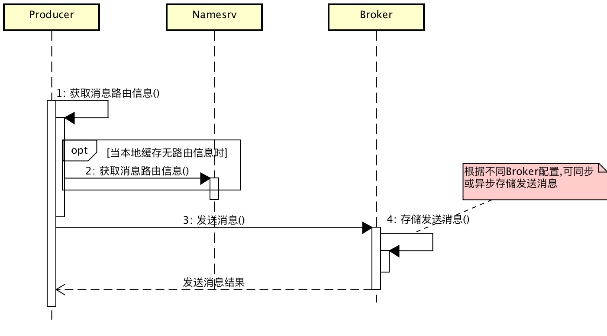
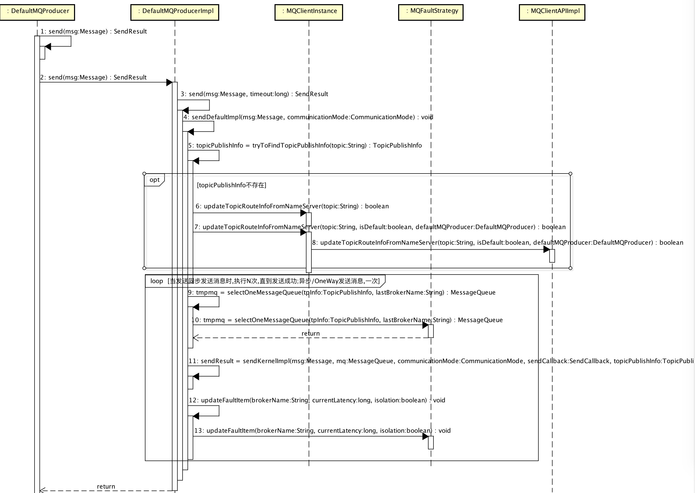
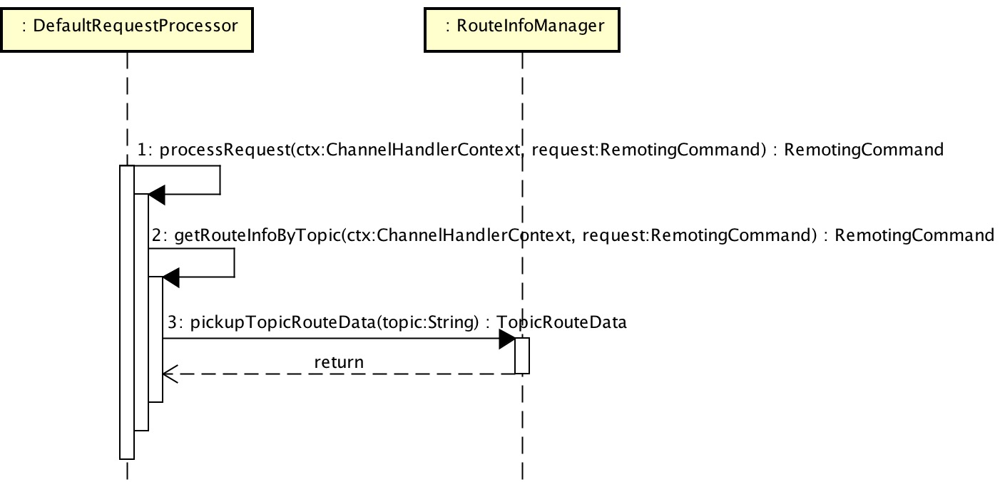

## 前言

本文主要解析 `Producer` **同步**发送消息源码，涉及到 异步/Oneway发送消息，事务消息会跳过。

当 `Producer` 发送消息时，会涉及到：

* `Namesrv`：提供消息路由(*TopicRoute*)。
* `Broker`：接收消息、持久化消息。

    > 

在开始解析具体的代码实现，我们来看下 `Producer` 、`Namesrv` 、`Broker` 的调用顺序图，先有全局的了解。

* `Producer` 发送消息顺序图：
    > 

* `Namesrv` 查询Topic路由信息API顺序图：
    > 
    
* `Broker` 接收发送消息API顺序图：
    > 

* `Broker` 存储发送消息顺序图：
    > 

## `Producer` 发送消息

###### DefaultMQProducer#send(Message)

```Java
  1: @Override
  2: public SendResult send(Message msg) throws MQClientException, RemotingException, MQBrokerException, InterruptedException {
  3:     return this.defaultMQProducerImpl.send(msg);
  4: }
```

* 说明：发送同步消息，`DefaultMQProducer#send(Message)` 对 `DefaultMQProducerImpl#send(Message)` 进行封装。  

###### DefaultMQProducerImpl#sendDefaultImpl()

```Java
  1: public SendResult send(Message msg) throws MQClientException, RemotingException, MQBrokerException, InterruptedException {
  2:     return send(msg, this.defaultMQProducer.getSendMsgTimeout());
  3: }
  4: 
  5: public SendResult send(Message msg, long timeout) throws MQClientException, RemotingException, MQBrokerException, InterruptedException {
  6:     return this.sendDefaultImpl(msg, CommunicationMode.SYNC, null, timeout);
  7: }
  8: 
  9: private SendResult sendDefaultImpl(//
 10:     Message msg, //
 11:     final CommunicationMode communicationMode, //
 12:     final SendCallback sendCallback, //
 13:     final long timeout//
 14: ) throws MQClientException, RemotingException, MQBrokerException, InterruptedException {
 15:     // 校验 Producer 处于运行状态
 16:     this.makeSureStateOK();
 17:     // 校验消息格式
 18:     Validators.checkMessage(msg, this.defaultMQProducer);
 19:     //
 20:     final long invokeID = random.nextLong(); // 调用编号；用于下面打印日志，标记为同一次发送消息
 21:     long beginTimestampFirst = System.currentTimeMillis();
 22:     long beginTimestampPrev = beginTimestampFirst;
 23:     long endTimestamp = beginTimestampFirst;
 24:     // 获取 Topic路由信息
 25:     TopicPublishInfo topicPublishInfo = this.tryToFindTopicPublishInfo(msg.getTopic());
 26:     if (topicPublishInfo != null && topicPublishInfo.ok()) {
 27:         MessageQueue mq = null; // 最后选择消息要发送到的队列
 28:         Exception exception = null;
 29:         SendResult sendResult = null; // 最后一次发送结果
 30:         int timesTotal = communicationMode == CommunicationMode.SYNC ? 1 + this.defaultMQProducer.getRetryTimesWhenSendFailed() : 1; // 同步多次调用
 31:         int times = 0; // 第几次发送
 32:         String[] brokersSent = new String[timesTotal]; // 存储每次发送消息选择的broker名
 33:         // 循环调用发送消息，直到成功
 34:         for (; times < timesTotal; times++) {
 35:             String lastBrokerName = null == mq ? null : mq.getBrokerName();
 36:             MessageQueue tmpmq = this.selectOneMessageQueue(topicPublishInfo, lastBrokerName); // 选择消息要发送到的队列
 37:             if (tmpmq != null) {
 38:                 mq = tmpmq;
 39:                 brokersSent[times] = mq.getBrokerName();
 40:                 try {
 41:                     beginTimestampPrev = System.currentTimeMillis();
 42:                     // 调用发送消息核心方法
 43:                     sendResult = this.sendKernelImpl(msg, mq, communicationMode, sendCallback, topicPublishInfo, timeout);
 44:                     endTimestamp = System.currentTimeMillis();
 45:                     // 更新故障信息
 46:                     this.updateFaultItem(mq.getBrokerName(), endTimestamp - beginTimestampPrev, false);
 47:                     switch (communicationMode) {
 48:                         case ASYNC:
 49:                             return null;
 50:                         case ONEWAY:
 51:                             return null;
 52:                         case SYNC:
 53:                             if (sendResult.getSendStatus() != SendStatus.SEND_OK) {
 54:                                 if (this.defaultMQProducer.isRetryAnotherBrokerWhenNotStoreOK()) { // 同步发送成功但存储有问题时 && 配置存储异常时重新发送开关 时，进行重试
 55:                                     continue;
 56:                                 }
 57:                             }
 58:                             return sendResult;
 59:                         default:
 60:                             break;
 61:                     }
 62:                 } catch (RemotingException e) { // 打印异常，更新故障信息，更新继续循环
 63:                     endTimestamp = System.currentTimeMillis();
 64:                     this.updateFaultItem(mq.getBrokerName(), endTimestamp - beginTimestampPrev, true);
 65:                     log.warn(String.format("sendKernelImpl exception, resend at once, InvokeID: %s, RT: %sms, Broker: %s", invokeID, endTimestamp - beginTimestampPrev, mq), e);
 66:                     log.warn(msg.toString());
 67:                     exception = e;
 68:                     continue;
 69:                 } catch (MQClientException e) { // 打印异常，更新故障信息，继续循环
 70:                     endTimestamp = System.currentTimeMillis();
 71:                     this.updateFaultItem(mq.getBrokerName(), endTimestamp - beginTimestampPrev, true);
 72:                     log.warn(String.format("sendKernelImpl exception, resend at once, InvokeID: %s, RT: %sms, Broker: %s", invokeID, endTimestamp - beginTimestampPrev, mq), e);
 73:                     log.warn(msg.toString());
 74:                     exception = e;
 75:                     continue;
 76:                 } catch (MQBrokerException e) { // 打印异常，更新故障信息，部分情况下的异常，直接返回，结束循环
 77:                     endTimestamp = System.currentTimeMillis();
 78:                     this.updateFaultItem(mq.getBrokerName(), endTimestamp - beginTimestampPrev, true);
 79:                     log.warn(String.format("sendKernelImpl exception, resend at once, InvokeID: %s, RT: %sms, Broker: %s", invokeID, endTimestamp - beginTimestampPrev, mq), e);
 80:                     log.warn(msg.toString());
 81:                     exception = e;
 82:                     switch (e.getResponseCode()) {
 83:                         // 如下异常continue，进行发送消息重试
 84:                         case ResponseCode.TOPIC_NOT_EXIST:
 85:                         case ResponseCode.SERVICE_NOT_AVAILABLE:
 86:                         case ResponseCode.SYSTEM_ERROR:
 87:                         case ResponseCode.NO_PERMISSION:
 88:                         case ResponseCode.NO_BUYER_ID:
 89:                         case ResponseCode.NOT_IN_CURRENT_UNIT:
 90:                             continue;
 91:                         // 如果有发送结果，进行返回，否则，抛出异常；
 92:                         default:
 93:                             if (sendResult != null) {
 94:                                 return sendResult;
 95:                             }
 96:                             throw e;
 97:                     }
 98:                 } catch (InterruptedException e) {
 99:                     endTimestamp = System.currentTimeMillis();
100:                     this.updateFaultItem(mq.getBrokerName(), endTimestamp - beginTimestampPrev, false);
101:                     log.warn(String.format("sendKernelImpl exception, throw exception, InvokeID: %s, RT: %sms, Broker: %s", invokeID, endTimestamp - beginTimestampPrev, mq), e);
102:                     log.warn(msg.toString());
103:                     throw e;
104:                 }
105:             } else {
106:                 break;
107:             }
108:         }
109:         // 返回发送结果
110:         if (sendResult != null) {
111:             return sendResult;
112:         }
113:         // 根据不同情况，抛出不同的异常
114:         String info = String.format("Send [%d] times, still failed, cost [%d]ms, Topic: %s, BrokersSent: %s", times, System.currentTimeMillis() - beginTimestampFirst,
115:                 msg.getTopic(), Arrays.toString(brokersSent)) + FAQUrl.suggestTodo(FAQUrl.SEND_MSG_FAILED);
116:         MQClientException mqClientException = new MQClientException(info, exception);
117:         if (exception instanceof MQBrokerException) {
118:             mqClientException.setResponseCode(((MQBrokerException) exception).getResponseCode());
119:         } else if (exception instanceof RemotingConnectException) {
120:             mqClientException.setResponseCode(ClientErrorCode.CONNECT_BROKER_EXCEPTION);
121:         } else if (exception instanceof RemotingTimeoutException) {
122:             mqClientException.setResponseCode(ClientErrorCode.ACCESS_BROKER_TIMEOUT);
123:         } else if (exception instanceof MQClientException) {
124:             mqClientException.setResponseCode(ClientErrorCode.BROKER_NOT_EXIST_EXCEPTION);
125:         }
126:         throw mqClientException;
127:     }
128:     // Namesrv找不到异常
129:     List<String> nsList = this.getmQClientFactory().getMQClientAPIImpl().getNameServerAddressList();
130:     if (null == nsList || nsList.isEmpty()) {
131:         throw new MQClientException(
132:             "No name server address, please set it." + FAQUrl.suggestTodo(FAQUrl.NAME_SERVER_ADDR_NOT_EXIST_URL), null).setResponseCode(ClientErrorCode.NO_NAME_SERVER_EXCEPTION);
133:     }
134:     // 消息路由找不到异常
135:     throw new MQClientException("No route info of this topic, " + msg.getTopic() + FAQUrl.suggestTodo(FAQUrl.NO_TOPIC_ROUTE_INFO),
136:         null).setResponseCode(ClientErrorCode.NOT_FOUND_TOPIC_EXCEPTION);
137: }
```
* 说明：发送消息。步骤：获取消息路由信息，选择要发送到的消息队列，执行消息发送。
* 第 1 行 到 第 7 行：对`sendsendDefaultImpl(...)`进行封装。
* 第 20 行 ：`invokeID`仅仅用于打印日志，无实际的业务用途。
* 第 25 行 ：获取 Topic路由信息， 详细解析见：[DefaultMQProducerImpl#tryToFindTopicPublishInfo()](#defaultmqproducerimpltrytofindtopicpublishinfo)

[xxx](#DefaultMQProducerImpl#tryToFindTopicPublishInfo())

###### DefaultMQProducerImpl#tryToFindTopicPublishInfo()

###### MQClientInstance#tryToFindTopicPublishInfo()

###### MQClientInstance#updateTopicRouteInfoFromNameServer()
 
```Java
1: private void updateTopicRouteInfoFromNameServer() {
2:     Set<String> topicList = new HashSet<String>();
3:     // Consumer 获取topic数组
4:     {
5:         Iterator<Entry<String, MQConsumerInner>> it = this.consumerTable.entrySet().iterator();
6:         while (it.hasNext()) {
7:             Entry<String, MQConsumerInner> entry = it.next();
8:             MQConsumerInner impl = entry.getValue();
9:             if (impl != null) {
10:                 Set<SubscriptionData> subList = impl.subscriptions();
11:                 if (subList != null) {
12:                     for (SubscriptionData subData : subList) {
13:                         topicList.add(subData.getTopic());
14:                     }
15:                 }
16:             }
17:         }
18:     }
19:     // Producer 获取topic数组
20:     {
21:         Iterator<Entry<String, MQProducerInner>> it = this.producerTable.entrySet().iterator();
22:         while (it.hasNext()) {
23:             Entry<String, MQProducerInner> entry = it.next();
24:             MQProducerInner impl = entry.getValue();
25:             if (impl != null) {
26:                 Set<String> lst = impl.getPublishTopicList();
27:                 topicList.addAll(lst);
28:             }
29:         }
30:     }
31:     // 逐个topic更新
32:     for (String topic : topicList) {
33:         this.updateTopicRouteInfoFromNameServer(topic);
34:     }
35: }
```

上述代码中

* 目的：从 `Namesrv` 获取 Topic路由信息，并更新本地缓存。
* 第 3 至 18 行：`Consumer` 获取topic数组
* 第 19 至 30 行：`Producer` 获取topic数组
* 第 31 至 34 行：逐个 Topic 更新

## `Producer` 发送消息

## `Broker` 存储消息


-------

下面是 `MQClientInstance.java` 的 `updateTopicRouteInfoFromNameServer()` 方法。


-------


