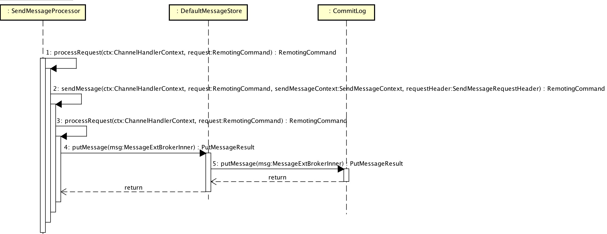

## 前言

本文主要解析 `Producer` **同步**发送消息源码，涉及到 异步/Oneway发送消息，事务消息会跳过。

当 `Producer` 发送消息时，会涉及到：

* `Namesrv`：提供消息路由(*TopicRoute*)。
* `Broker`：接收消息、持久化消息。

TODO 此处有一图

在开始解析具体的代码实现，我们来看下 `Producer` 、`Namesrv` 、`Broker` 的调用顺序图，先有全局的了解。

* `Producer` 发送消息顺序图：
    > 

* `Namesrv` 查询Topic路由信息API顺序图：
    > 
    
* `Broker` 接收发送消息API顺序图：
    > 

* `Broker` 存储发送消息：
    > 

## `Producer` 发送消息序列图

###### *DefaultMQProducer#send()*


###### *DefaultMQProducerImpl#sendDefaultImpl()*

###### *MQClientInstance#tryToFindTopicPublishInfo()*

###### *MQClientInstance#updateTopicRouteInfoFromNameServer()*
 
```Java
1: private void updateTopicRouteInfoFromNameServer() {
2:     Set<String> topicList = new HashSet<String>();
3:     // Consumer 获取topic数组
4:     {
5:         Iterator<Entry<String, MQConsumerInner>> it = this.consumerTable.entrySet().iterator();
6:         while (it.hasNext()) {
7:             Entry<String, MQConsumerInner> entry = it.next();
8:             MQConsumerInner impl = entry.getValue();
9:             if (impl != null) {
10:                 Set<SubscriptionData> subList = impl.subscriptions();
11:                 if (subList != null) {
12:                     for (SubscriptionData subData : subList) {
13:                         topicList.add(subData.getTopic());
14:                     }
15:                 }
16:             }
17:         }
18:     }
19:     // Producer 获取topic数组
20:     {
21:         Iterator<Entry<String, MQProducerInner>> it = this.producerTable.entrySet().iterator();
22:         while (it.hasNext()) {
23:             Entry<String, MQProducerInner> entry = it.next();
24:             MQProducerInner impl = entry.getValue();
25:             if (impl != null) {
26:                 Set<String> lst = impl.getPublishTopicList();
27:                 topicList.addAll(lst);
28:             }
29:         }
30:     }
31:     // 逐个topic更新
32:     for (String topic : topicList) {
33:         this.updateTopicRouteInfoFromNameServer(topic);
34:     }
35: }
```

上述代码中

* 目的：从 `Namesrv` 获取 Topic路由信息，并更新本地缓存。
* 第 3 至 18 行：`Consumer` 获取topic数组
* 第 19 至 30 行：`Producer` 获取topic数组
* 第 31 至 34 行：逐个 Topic 更新

## `Producer` 发送消息

## `Broker` 存储消息


-------

下面是 `MQClientInstance.java` 的 `updateTopicRouteInfoFromNameServer()` 方法。


-------


