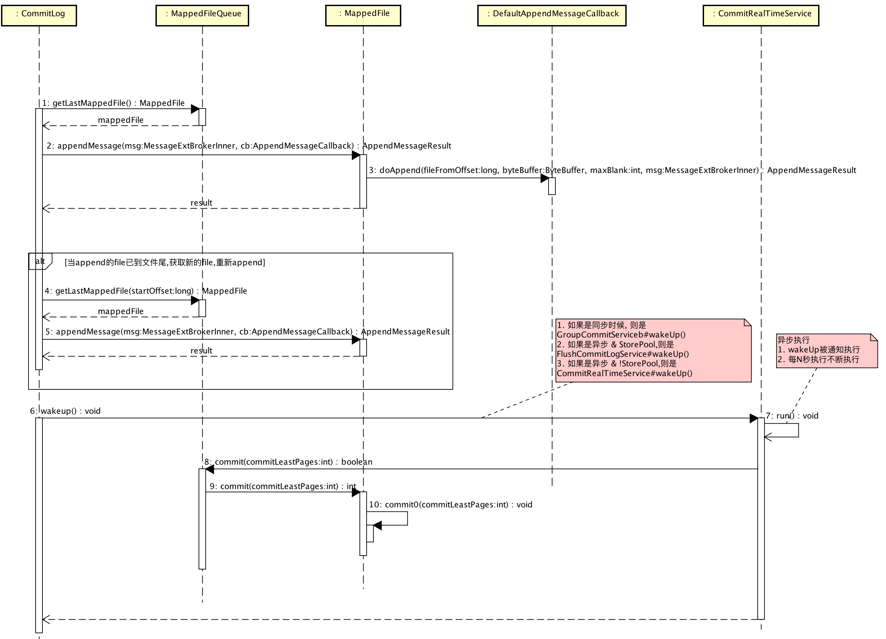
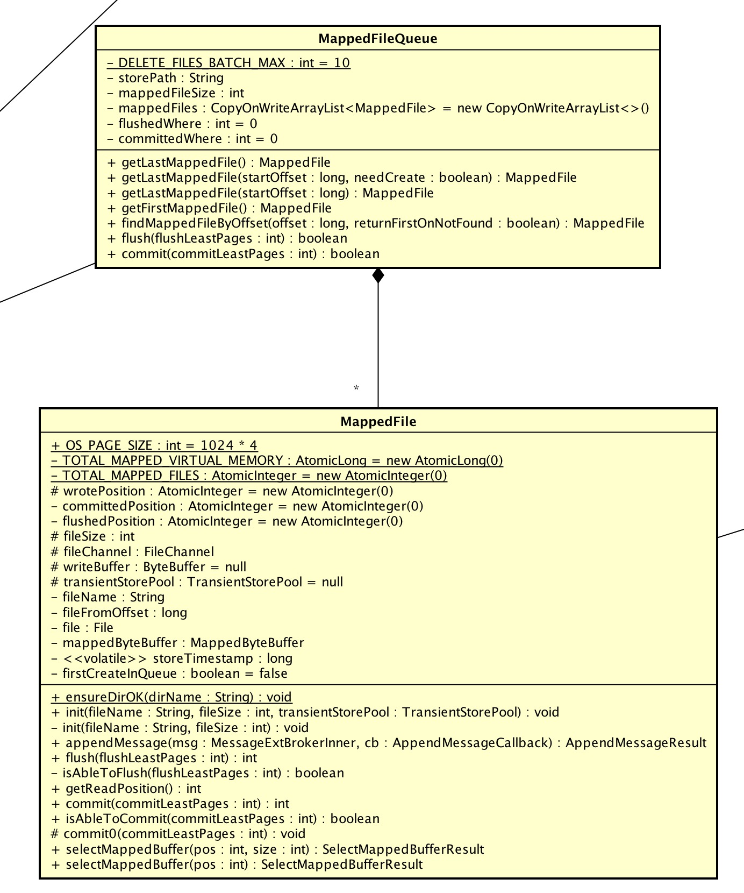

# 1、概述

本文接[《RocketMQ源码解析：Message发送&接收》](https://github.com/YunaiV/Blog/blob/master/RocketMQ/1003-RocketMQ%E6%BA%90%E7%A0%81%E8%A7%A3%E6%9E%90%EF%BC%9AMessage%E5%8F%91%E9%80%81%26%E6%8E%A5%E6%94%B6.md)。
主要解析 `CommitLog` 存储消息部分。考虑到 `CommitLog` 的初始化加载、过期删除有一些关系，因此，一起一起😈。

# 2、CommitLog 存储消息

> 

## CommitLog#putMessage(...)

```Java
  1: public PutMessageResult putMessage(final MessageExtBrokerInner msg) {
  2:     // Set the storage time
  3:     msg.setStoreTimestamp(System.currentTimeMillis());
  4:     // Set the message body BODY CRC (consider the most appropriate setting
  5:     // on the client)
  6:     msg.setBodyCRC(UtilAll.crc32(msg.getBody()));
  7:     // Back to Results
  8:     AppendMessageResult result = null;
  9: 
 10:     StoreStatsService storeStatsService = this.defaultMessageStore.getStoreStatsService();
 11: 
 12:     String topic = msg.getTopic();
 13:     int queueId = msg.getQueueId();
 14: 
 15:     // 事务相关 TODO 待读：事务相关
 16:     final int tranType = MessageSysFlag.getTransactionValue(msg.getSysFlag());
 17:     if (tranType == MessageSysFlag.TRANSACTION_NOT_TYPE//
 18:         || tranType == MessageSysFlag.TRANSACTION_COMMIT_TYPE) {
 19:         // Delay Delivery
 20:         if (msg.getDelayTimeLevel() > 0) {
 21:             if (msg.getDelayTimeLevel() > this.defaultMessageStore.getScheduleMessageService().getMaxDelayLevel()) {
 22:                 msg.setDelayTimeLevel(this.defaultMessageStore.getScheduleMessageService().getMaxDelayLevel());
 23:             }
 24: 
 25:             topic = ScheduleMessageService.SCHEDULE_TOPIC;
 26:             queueId = ScheduleMessageService.delayLevel2QueueId(msg.getDelayTimeLevel());
 27: 
 28:             // Backup real topic, queueId
 29:             MessageAccessor.putProperty(msg, MessageConst.PROPERTY_REAL_TOPIC, msg.getTopic());
 30:             MessageAccessor.putProperty(msg, MessageConst.PROPERTY_REAL_QUEUE_ID, String.valueOf(msg.getQueueId()));
 31:             msg.setPropertiesString(MessageDecoder.messageProperties2String(msg.getProperties()));
 32: 
 33:             msg.setTopic(topic);
 34:             msg.setQueueId(queueId);
 35:         }
 36:     }
 37: 
 38:     long eclipseTimeInLock = 0;
 39: 
 40:     // 获取写入映射文件
 41:     MappedFile unlockMappedFile = null;
 42:     MappedFile mappedFile = this.mappedFileQueue.getLastMappedFile();
 43: 
 44:     // 获取写入锁
 45:     lockForPutMessage(); //spin...
 46:     try {
 47:         long beginLockTimestamp = this.defaultMessageStore.getSystemClock().now();
 48:         this.beginTimeInLock = beginLockTimestamp;
 49: 
 50:         // Here settings are stored timestamp, in order to ensure an orderly
 51:         // global
 52:         msg.setStoreTimestamp(beginLockTimestamp);
 53: 
 54:         // 当不存在映射文件时，进行创建
 55:         if (null == mappedFile || mappedFile.isFull()) {
 56:             mappedFile = this.mappedFileQueue.getLastMappedFile(0); // Mark: NewFile may be cause noise
 57:         }
 58:         if (null == mappedFile) {
 59:             log.error("create maped file1 error, topic: " + msg.getTopic() + " clientAddr: " + msg.getBornHostString());
 60:             beginTimeInLock = 0;
 61:             return new PutMessageResult(PutMessageStatus.CREATE_MAPEDFILE_FAILED, null);
 62:         }
 63: 
 64:         // 存储消息
 65:         result = mappedFile.appendMessage(msg, this.appendMessageCallback);
 66:         switch (result.getStatus()) {
 67:             case PUT_OK:
 68:                 break;
 69:             case END_OF_FILE: // 当文件尾时，获取新的映射文件，并进行插入
 70:                 unlockMappedFile = mappedFile;
 71:                 // Create a new file, re-write the message
 72:                 mappedFile = this.mappedFileQueue.getLastMappedFile(0);
 73:                 if (null == mappedFile) {
 74:                     // XXX: warn and notify me
 75:                     log.error("create maped file2 error, topic: " + msg.getTopic() + " clientAddr: " + msg.getBornHostString());
 76:                     beginTimeInLock = 0;
 77:                     return new PutMessageResult(PutMessageStatus.CREATE_MAPEDFILE_FAILED, result);
 78:                 }
 79:                 result = mappedFile.appendMessage(msg, this.appendMessageCallback);
 80:                 break;
 81:             case MESSAGE_SIZE_EXCEEDED:
 82:             case PROPERTIES_SIZE_EXCEEDED:
 83:                 beginTimeInLock = 0;
 84:                 return new PutMessageResult(PutMessageStatus.MESSAGE_ILLEGAL, result);
 85:             case UNKNOWN_ERROR:
 86:                 beginTimeInLock = 0;
 87:                 return new PutMessageResult(PutMessageStatus.UNKNOWN_ERROR, result);
 88:             default:
 89:                 beginTimeInLock = 0;
 90:                 return new PutMessageResult(PutMessageStatus.UNKNOWN_ERROR, result);
 91:         }
 92: 
 93:         eclipseTimeInLock = this.defaultMessageStore.getSystemClock().now() - beginLockTimestamp;
 94:         beginTimeInLock = 0;
 95:     } finally {
 96:         // 释放写入锁
 97:         releasePutMessageLock();
 98:     }
 99: 
100:     if (eclipseTimeInLock > 500) {
101:         log.warn("[NOTIFYME]putMessage in lock cost time(ms)={}, bodyLength={} AppendMessageResult={}", eclipseTimeInLock, msg.getBody().length, result);
102:     }
103: 
104:     // 
105:     if (null != unlockMappedFile && this.defaultMessageStore.getMessageStoreConfig().isWarmMapedFileEnable()) {
106:         this.defaultMessageStore.unlockMappedFile(unlockMappedFile);
107:     }
108: 
109:     PutMessageResult putMessageResult = new PutMessageResult(PutMessageStatus.PUT_OK, result);
110: 
111:     // Statistics
112:     storeStatsService.getSinglePutMessageTopicTimesTotal(msg.getTopic()).incrementAndGet();
113:     storeStatsService.getSinglePutMessageTopicSizeTotal(topic).addAndGet(result.getWroteBytes());
114: 
115:     // 进行同步||异步 flush||commit
116:     GroupCommitRequest request = null;
117:     // Synchronization flush
118:     if (FlushDiskType.SYNC_FLUSH == this.defaultMessageStore.getMessageStoreConfig().getFlushDiskType()) {
119:         final GroupCommitService service = (GroupCommitService) this.flushCommitLogService;
120:         if (msg.isWaitStoreMsgOK()) {
121:             request = new GroupCommitRequest(result.getWroteOffset() + result.getWroteBytes());
122:             service.putRequest(request);
123:             boolean flushOK = request.waitForFlush(this.defaultMessageStore.getMessageStoreConfig().getSyncFlushTimeout());
124:             if (!flushOK) {
125:                 log.error("do groupcommit, wait for flush failed, topic: " + msg.getTopic() + " tags: " + msg.getTags()
126:                     + " client address: " + msg.getBornHostString());
127:                 putMessageResult.setPutMessageStatus(PutMessageStatus.FLUSH_DISK_TIMEOUT);
128:             }
129:         } else {
130:             service.wakeup();
131:         }
132:     }
133:     // Asynchronous flush
134:     else {
135:         if (!this.defaultMessageStore.getMessageStoreConfig().isTransientStorePoolEnable()) {
136:             flushCommitLogService.wakeup(); // important：唤醒commitLog线程，进行flush
137:         } else {
138:             commitLogService.wakeup();
139:         }
140:     }
141: 
142:     // Synchronous write double 如果是同步Master，同步到从节点 // TODO 待读：数据同步
143:     if (BrokerRole.SYNC_MASTER == this.defaultMessageStore.getMessageStoreConfig().getBrokerRole()) {
144:         HAService service = this.defaultMessageStore.getHaService();
145:         if (msg.isWaitStoreMsgOK()) {
146:             // Determine whether to wait
147:             if (service.isSlaveOK(result.getWroteOffset() + result.getWroteBytes())) {
148:                 if (null == request) {
149:                     request = new GroupCommitRequest(result.getWroteOffset() + result.getWroteBytes());
150:                 }
151:                 service.putRequest(request);
152: 
153:                 service.getWaitNotifyObject().wakeupAll();
154: 
155:                 boolean flushOK =
156:                     // TODO
157:                     request.waitForFlush(this.defaultMessageStore.getMessageStoreConfig().getSyncFlushTimeout());
158:                 if (!flushOK) {
159:                     log.error("do sync transfer other node, wait return, but failed, topic: " + msg.getTopic() + " tags: "
160:                         + msg.getTags() + " client address: " + msg.getBornHostString());
161:                     putMessageResult.setPutMessageStatus(PutMessageStatus.FLUSH_SLAVE_TIMEOUT);
162:                 }
163:             }
164:             // Slave problem
165:             else {
166:                 // Tell the producer, slave not available
167:                 putMessageResult.setPutMessageStatus(PutMessageStatus.SLAVE_NOT_AVAILABLE);
168:             }
169:         }
170:     }
171: 
172:     return putMessageResult;
173: }
```

* 说明 ：存储消息，并返回存储结果。
* 第 2 行 ：设置存储时间等。
* 第 16 至 36 行 ：事务消息相关，暂未了解。
* 第 45 & 97 行 ：获取锁与释放锁。
* 第 52 行 ：再次设置存储时间。目前会有多处地方设置存储时间。
* 第 55 至 62 行 ：获取 `MappedFile`，若不存在或已满，则进行创建。详细解析见：[MappedFileQueue#getLastMappedFile(...)](#mappedfilequeuegetlastmappedfile)。
* 第 65 行 ：**插入消息**到 `MappedFile`，解析解析见：[MappedFile#appendMessage(...)](#mappedfileappendmessage)。
* 第 69 至 80 行 ：`MappedFile` 已满，创建新的，再次**插入消息**。
* 第 116 至 140 行 ：**消息刷盘**，即持久化到文件。上面**插入消息**实际未存储到硬盘。此处，根据不同的刷盘策略，执行会有不同。详细解析见：[FlushCommitLogService](#flushcommitlogservice)。
* 第 143 至 173 行 ：`Broker` 主从同步。后面的文章会详细解析😈。

## MappedFileQueue#getLastMappedFile(...)



```Java
  1: public MappedFile getLastMappedFile(final long startOffset, boolean needCreate) {
  2:     long createOffset = -1; // 创建文件开始offset。-1时，不创建
  3:     MappedFile mappedFileLast = getLastMappedFile();
  4: 
  5:     if (mappedFileLast == null) { // 一个映射文件都不存在
  6:         createOffset = startOffset - (startOffset % this.mappedFileSize);
  7:     }
  8: 
  9:     if (mappedFileLast != null && mappedFileLast.isFull()) { // 最后一个文件已满
 10:         createOffset = mappedFileLast.getFileFromOffset() + this.mappedFileSize;
 11:     }
 12: 
 13:     if (createOffset != -1 && needCreate) { // 创建文件
 14:         String nextFilePath = this.storePath + File.separator + UtilAll.offset2FileName(createOffset);
 15:         String nextNextFilePath = this.storePath + File.separator
 16:             + UtilAll.offset2FileName(createOffset + this.mappedFileSize);
 17:         MappedFile mappedFile = null;
 18: 
 19:         if (this.allocateMappedFileService != null) {
 20:             mappedFile = this.allocateMappedFileService.putRequestAndReturnMappedFile(nextFilePath,
 21:                 nextNextFilePath, this.mappedFileSize);
 22:         } else {
 23:             try {
 24:                 mappedFile = new MappedFile(nextFilePath, this.mappedFileSize);
 25:             } catch (IOException e) {
 26:                 log.error("create mappedFile exception", e);
 27:             }
 28:         }
 29: 
 30:         if (mappedFile != null) {
 31:             if (this.mappedFiles.isEmpty()) {
 32:                 mappedFile.setFirstCreateInQueue(true);
 33:             }
 34:             this.mappedFiles.add(mappedFile);
 35:         }
 36: 
 37:         return mappedFile;
 38:     }
 39: 
 40:     return mappedFileLast;
 41: }
```

* 说明：获取最后一个 `MappedFile`，若不存在，则进行创建。

## MappedFile#appendMessage(...)

## DefaultAppendMessageCallback#doAppend(...)

## Message存储结构

## FlushCommitLogService

### CommitRealTimeService
### FlushRealTimeService
### GroupCommitService

# 3、CommitLog 初始化加载
# 4、CommitLog 过期删除

